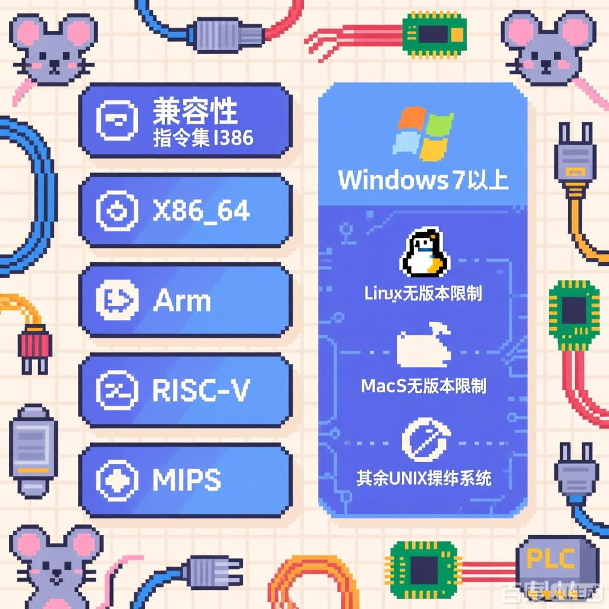

# Modbus 工具箱

  

Modbus 工具箱是为了方便广大朋友更加快捷，稳定的调试 Modbus 通讯协议所创建的工具集，实现了 RTU/TCP 传输层的服务器端与客户端，还特增加对 RTU 通讯进行静默侦听的功能。界面通过命令行图形界面的方式呈现，精简高效，所有主流操作系统都可通过命令行终端运行软件，单文件，无任何依赖，是男女老少调试 Modbus 通讯的不可或缺之工具。

## 主要功能列表
  

1. Modbus TCP/RTU 服务端/客户端
- TUI表格界面，单次/批量 进行 读取/修改
- 多数据进制显示与修改 十进制/二进制/十六进制
- 定时读取，写入进行稳定性测试  

2. 设备记忆
- 通过配置文件记录读取过的设备的连接方式，长期使用可收藏为设备
- 给寄存器地址标注释，虚拟变量建立，方便理解

3. Modbus RTU 静默监听分析
- 实时历史流水
- 读取的地址，功能码，频次等信息进行统计，并提供一览表

## 兼容性(后有详细列表)
  

### 指令集
1. I386
2. X86_64
3. Arm
4. risc-v
5. mips
### 操作系统
1. Windows 7 以上
2. Linux 无版本限制
3. MacOS 无版本限制
4. 其余 UNIX 操作系统

## 操作指南

## 配置文件

## 开发指北

## 依赖项目
详见 cargo.toml
1. ratatui 终端图形界面
2. tokio全家桶 异步 网络 串口 modbus
3. anyhow 错误类型

## 兼容性列表
| 目标架构               | GCC 版本 | Clang 版本 | C++ 支持 | Rust 版本 | 状态 |
|----------------------------------|-------------|---------------|-------------|--------------|--------|
| arch64-linux-android [1]         | 9.0.8       | 9.0.8         | ✓           | 6.1.0        | ✓      |
| aarch64-unknown-linux-gnu        | 2.23        | 5.4.0         | ✓           | 5.1.0        | ✓      |
| aarch64-unknown-linux-musl       | 1.1.24      | 9.2.0         | ✓           | 6.1.0        | ✓      |
| arm-linux-androideabi [1]        | 9.0.8       | 9.0.8         | ✓           | 6.1.0        | ✓      |
| arm-unknown-linux-gnueabi        | 2.23        | 5.4.0         | ✓           | 5.1.0        | ✓      |
| arm-unknown-linux-gnueabihf      | 2.17        | 8.3.0         | ✓           | 6.1.0        | ✓      |
| arm-unknown-linux-musleabi       | 1.1.24      | 9.2.0         | ✓           | 6.1.0        | ✓      |
| arm-unknown-linux-musleabihf     | 1.1.24      | 9.2.0         | ✓           | 6.1.0        | ✓      |
| armv5te-unknown-linux-gnueabi    | 2.27        | 7.5.0         | ✓           | 6.1.0        | ✓      |
| armv5te-unknown-linux-musleabi   | 1.1.24      | 9.2.0         | ✓           | 6.1.0        | ✓      |
| armv7-linux-androideabi [1]      | 9.0.8       | 9.0.8         | ✓           | 6.1.0        | ✓      |
| armv7-unknown-linux-gnueabi      | 2.27        | 7.5.0         | ✓           | 6.1.0        | ✓      |
| armv7-unknown-linux-gnueabihf    | 2.23        | 5.4.0         | ✓           | 5.1.0        | ✓      |
| armv7-unknown-linux-musleabi     | 1.1.24      | 9.2.0         | ✓           | 6.1.0        | ✓      |
| armv7-unknown-linux-musleabihf   | 1.1.24      | 9.2.0         | ✓           | 6.1.0        | ✓      |
| i586-unknown-linux-gnu           | 2.23        | 5.4.0         | ✓           | N/A          | ✓      |
| i586-unknown-linux-musl          | 1.1.24      | 9.2.0         | ✓           | N/A          | ✓      |
| i686-unknown-freebsd             | 1.5         | 6.4.0         | ✓           | N/A          |        |
| i686-linux-android [1]           | 9.0.8       | 9.0.8         | ✓           | 6.1.0        | ✓      |
| i686-pc-windows-gnu              | N/A         | 7.5           | ✓           | N/A          | ✓      |
| i686-unknown-linux-gnu           | 2.23        | 5.4.0         | ✓           | 5.1.0        | ✓      |
| i686-unknown-linux-musl          | 1.1.24      | 9.2.0         | ✓           | N/A          | ✓      |
| mips-unknown-linux-gnu           | 2.23        | 5.4.0         | ✓           | 5.1.0        | ✓      |
| mips-unknown-linux-musl          | 1.1.24      | 9.2.0         | ✓           | 6.1.0        | ✓      |
| mips64-unknown-linux-gnuabi64    | 2.23        | 5.4.0         | ✓           | 5.1.0        | ✓      |
| mips64-unknown-linux-muslabi64   | 1.1.24      | 9.2.0         | ✓           | 6.1.0        | ✓      |
| mips64el-unknown-linux-gnuabi64  | 2.23        | 5.4.0         | ✓           | 5.1.0        | ✓      |
| mips64el-unknown-linux-muslabi64 | 1.1.24      | 9.2.0         | ✓           | 6.1.0        | ✓      |
| mipsel-unknown-linux-gnu         | 2.23        | 5.4.0         | ✓           | 5.1.0        | ✓      |
| mipsel-unknown-linux-musl        | 1.1.24      | 9.2.0         | ✓           | 6.1.0        | ✓      |
| powerpc-unknown-linux-gnu        | 2.23        | 5.4.0         | ✓           | 5.1.0        | ✓      |
| powerpc64-unknown-linux-gnu      | 2.23        | 5.4.0         | ✓           | 5.1.0        | ✓      |
| powerpc64le-unknown-linux-gnu    | 2.23        | 5.4.0         | ✓           | 5.1.0        | ✓      |
| riscv64gc-unknown-linux-gnu      | 2.27        | 7.5.0         | ✓           | 6.1.0        | ✓      |
| s390x-unknown-linux-gnu          | 2.23        | 5.4.0         | ✓           | 5.1.0        | ✓      |
| sparc64-unknown-linux-gnu        | 2.23        | 5.4.0         | ✓           | 5.1.0        | ✓      |
| sparcv9-sun-solaris              | 1.22.7      | 8.4.0         | ✓           | N/A          |        |
| thumbv6m-none-eabi [4]           | 2.2.0       | 4.9.3         |             | N/A          |        |
| thumbv7em-none-eabi [4]          | 2.2.0       | 4.9.3         |             | N/A          |        |
| thumbv7em-none-eabihf [4]        | 2.2.0       | 4.9.3         |             | N/A          |        |
| thumbv7m-none-eabi [4]           | 2.2.0       | 4.9.3         |             | N/A          |        |
| thumbv7neon-linux-androideabi [1]| 9.0.8       | 9.0.8         | ✓           | 6.1.0        | ✓      |
| thumbv7neon-unknown-linux-gnueabihf | 2.23     | 5.4.0         | ✓           | 5.1.0        | ✓      |
| wasm32-unknown-emscripten [6]    | 3.1.14      | 15.0.0        | ✓           | N/A          | ✓      |
| x86_64-linux-android [1]         | 9.0.8       | 9.0.8         | ✓           | 6.1.0        | ✓      |
| x86_64-pc-windows-gnu            | N/A         | 7.3           | ✓           | N/A          | ✓      |
| x86_64-sun-solaris               | 1.22.7      | 8.4.0         | ✓           | N/A          |        |
| x86_64-unknown-freebsd           | 1.5         | 6.4.0         | ✓           | N/A          |        |
| x86_64-unknown-dragonfly [2] [3] | 6.0.1       | 5.3.0         | ✓           | N/A          |        |
| x86_64-unknown-illumos           | 1.20.4      | 8.4.0         | ✓           | N/A          |        |
| x86_64-unknown-linux-gnu         | 2.23        | 5.4.0         | ✓           | 5.1.0        | ✓      |
| x86_64-unknown-linux-gnu:centos [5] | 2.17     | 4.8.5         | ✓           | 4.2.1        | ✓      |
| x86_64-unknown-linux-musl        | 1.1.24      | 9.2.0         | ✓           | N/A          | ✓      |
| x86_64-unknown-netbsd [3]        | 9.2.0       | 9.4.0         | ✓           | N/A          |        |

说明：
1. 表格列包括目标架构、GCC 版本、Clang 版本、C++ 支持状态、Rust 版本和整体状态。
2. “✓” 表示支持或可用，“N/A” 表示不适用或未提供。
3. 标注 [1]、[2]、[3]、[4]、[5]、[6] 表示特定平台或配置的说明信息。

